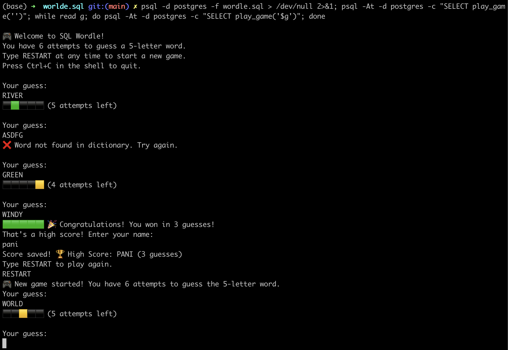

# Wordle.sql

A Wordle implementation in pure SQL! Play Wordle directly in your PostgreSQL database.

## Quick Start

### Option 1: One-liner

```bash
psql -d postgres -f wordle.sql > /dev/null 2>&1; psql -At -d postgres -c "SELECT play_game('')"; while read g; do psql -At -d postgres -c "SELECT play_game('$g')"; done
```

### Option 2: Using the script

```bash
./play.sh
```

## Installation

### Mac

```bash
# Install PostgreSQL
brew install postgresql@14

# Start PostgreSQL (choose one):
brew services start postgresql@14  # Runs in background
# OR
pg_ctl -D /opt/homebrew/var/postgresql@14 start  # Manual start
```

### Docker

```bash
# Build and run in container
docker build -t sql-wordle .
docker run --rm -it sql-wordle
```

## How to Play

1. Start a new game
2. Guess a 5-letter word
3. Get feedback:
   - 🟩 Green: Letter is correct and in the right spot
   - 🟨 Yellow: Letter is in the word but wrong spot
   - ⬛ Gray: Letter is not in the word
4. You have 6 attempts to guess the word
5. Type `RESTART` anytime to start a new game


## Database Inspection

Connect to PostgreSQL (`psql postgres`) and try these queries:

```sql
-- View word dictionary
SELECT * FROM words LIMIT 10;

-- Check current secret word
SELECT * FROM secret_word;

-- View your guesses and feedback
SELECT
    guess,
    render_feedback(guess) AS feedback,
    created_at
FROM guesses
ORDER BY created_at;

-- Check high score
SELECT * FROM high_score;
```

## Example Game

```
🎮 Welcome to SQL Wordle!
You have 6 attempts to guess a 5-letter word.
Type RESTART at any time to start a new game.
Press Ctrl+C in the shell to quit.

Your guess:
RIVER
⬛🟩⬛⬛⬛ (5 attempts left)

Your guess:
ASDFG
❌ Word not found in dictionary. Try again.

Your guess:
GREEN
⬛⬛⬛⬛🟨 (4 attempts left)

Your guess:
WINDY
🟩🟩🟩🟩🟩 🎉 Congratulations! You won in 3 guesses!
That's a high score! Enter your name:
pani
Score saved! 🏆 High Score: PANI (3 guesses)
```


